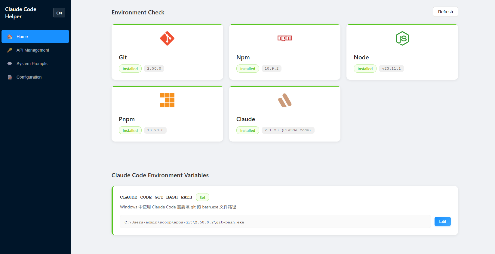

# Claude Code Helper (cc-help)

English | [中文](./README.md)

A lightweight CLI tool to help install and configure Claude Code.

## Features

- 🏠 **Environment Check** - Detect development tools in your system (Git, Node, NPM, PNPM, Claude)
- 🔑 **API Management** - Manage multiple Claude API configurations with quick switching
- 💬 **System Prompt Management** - Customize and manage system prompts
- ⚙️ **Environment Variables** - Manage Claude Code related environment variables
- 📝 **Configuration Management** - Unified management of all configuration items

## Installation

### Global Installation

```bash
npm install -g cc-help
```

### Using npx (No Installation Required)

```bash
npx cc-help
```

## Usage

After installation, simply run:

```bash
cc-help
```

Or use npx:

```bash
npx cc-help
```

The program will automatically start a web interface and open the management panel in your browser.

## Screenshots



## System Requirements

- Node.js >= 18.0.0
- Windows / macOS / Linux

## Configuration File Locations

- API Configuration: `~/.claude/api-configs.json`
- Settings: `~/.claude/settings.json`
- Database: `data.db` in project root

## Development

```bash
# Clone the repository
git clone https://github.com/5ibug/cc-help.git
cd cc-help

# Install dependencies
npm install

# Build frontend
npm run build

# Start
npm start
```

## License

MIT

## Contributing

Issues and Pull Requests are welcome!
